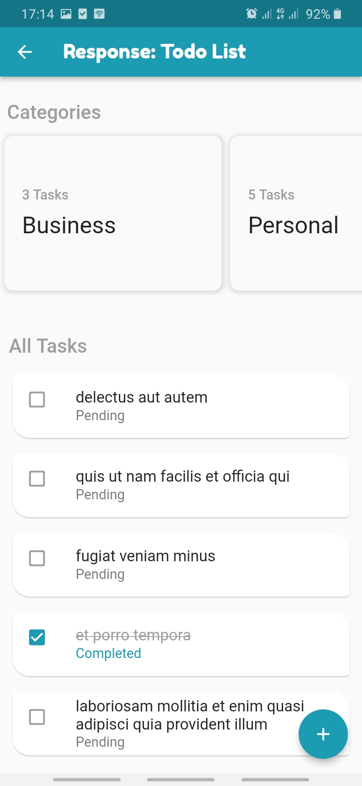
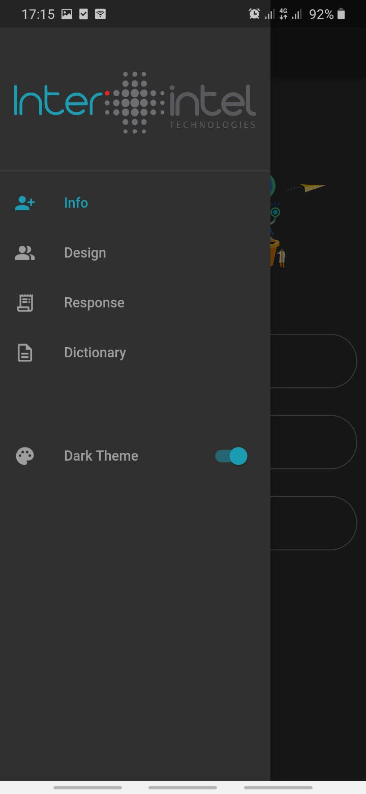

# InterIntel Test App

InterIntel Flutter Interview Test

## App Description

This is a Flutter project about:

- Acquiring user information and displaying it
- Fetching data from a network API and displaying to a user
- Converting map data into a list and sorting
- Displaying amazing animations

## Highlights

### 1. Navigation

The App entails a custom drawer that helps to navigate between Info Screen, 
Design Screen, Response Screen and Dictionary Screen.

### 2. Info Screen

This screen entails a form that captures basic user information i.e name, email and phone number.
Once this information is submitted, it is stored in shared preferences and the app navigates to 
the Design page for the user to view the information.

### 3. Design Screen

This page displays User information on a card widget. A user can edit the information or remove entirely.
I have also included custom widgets that perform explicit animations that can make good impressions 
to users.

### 4. Response Screen

This page makes a call to an API and the data retrieved is displayed on screen.
Link: [https://jsonplaceholder.typicode.com/todos?_limit=5](https://jsonplaceholder.typicode.com/todos?_limit=5)

### 5. Dictionary Screen

This screen converts map data to a list of map entries which can be ordered by their keys and values i.e
by alphabetical order or by numeric order

## Other Features

- Local Push Notifications
- Navigation animations
- Dark theme integration

  

- Splash Screen

## apk Link

Click [here](https://drive.google.com/file/d/12UfPMmDyJTRHZrX-yX59m21i6AhFuY0W/view?usp=sharing) if 
you wish to download the apk file for this amazing app.